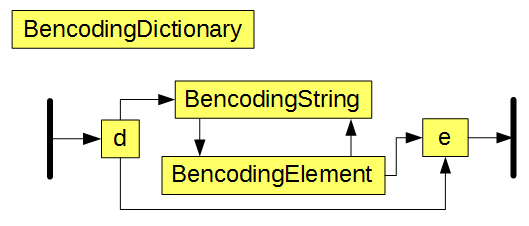

# jbencode
## Java library for parsing and creating bencoded files and strings

It is based on the specification [here](https://wiki.theory.org/BitTorrentSpecification#Bencoding "Bencoding specification")

##### Basically :
---

##### Where :
---

---

---

---


### Usage :

#### Parsing a bencoded string :
Create a Bencoder object :
```java
Bencoder bencoder = new Bencoder();
```
Then call the `read` method on a string :
```java
String test = "i20ei-30e6:ciaron5:rider";
List<BencodingElement> elements = bencoder.read(test);
```
Print out the data :
```java
for (BencodingElement element : elements) {
  System.out.println(element);
}
```
Outputs :
```
20
-30
ciaron
rider
```
#### Parsing a bencoded file :
Create a Bencoder object :
```java
Bencoder bencoder = new Bencoder();
```
Then call the `read` method on a file :
```java
File test = new File("test.dat");
List<BencodingElement> elements = bencoder.read(test);
```
Print out the data :
```java
for (BencodingElement element : elements) {
  System.out.println(element);
}
```
#### Creating a bencoded string
Create a Bencoder object :
```java
Bencoder bencoder = new Bencoder();
```
Create a list of elements :
```java
List<BencodingElement> elements = new ArrayList<>();
elements.add(new BencodingNumber(100));
elements.add(new BencodingString("testString"));
```
Call the write method to write the elements as bencoded data:
```java
String outString = bencoder.write(elements);
System.out.println(outString);
```
Outputs :
```
i100e10testString
```
#### Creating a bencoded file
Create a Bencoder object :
```java
Bencoder bencoder = new Bencoder();
```
Create a list of elements :
```java
List<BencodingElement> elements = new ArrayList<>();
elements.add(new BencodingNumber(100));
elements.add(new BencodingString("testString"));
```
Create an output filer :
```java
File test = new File("test.dat");
```
Call the write method to write the elements as bencoded data to file:
```java
bencoder.write(elements, file);
```
#### Converting real data to bencoded data
Create your data :
```java
final HashMap<String, Object> objects = new HashMap<>();
objects.put("a", "test");
objects.put("b", 1);
objects.put("c", 2); // Or you could ArrayList<Objects> or other HashMaps
```
Pass you data into the Bencoded Type constructor :
```java
BencodingDictionary bencodingDict = new BencodingDictionary(objects);
```
